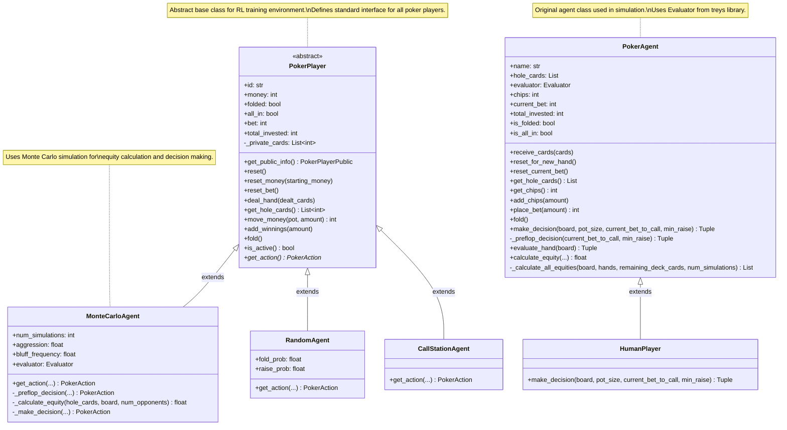
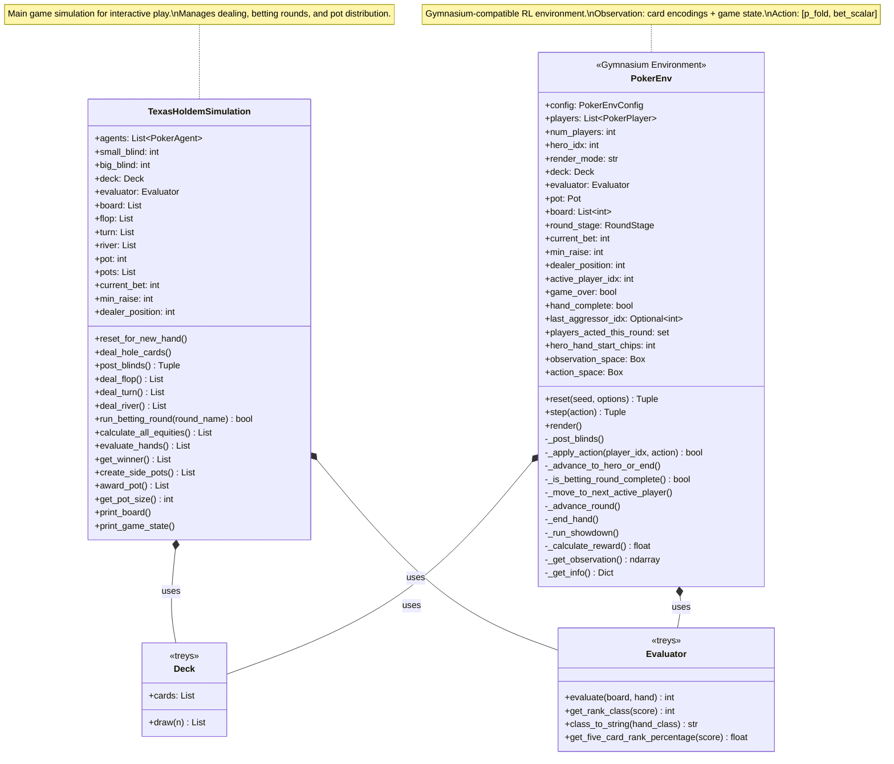
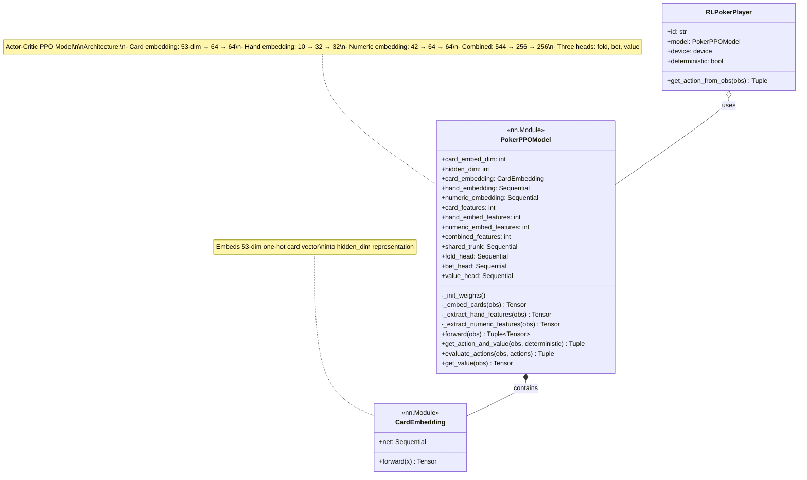
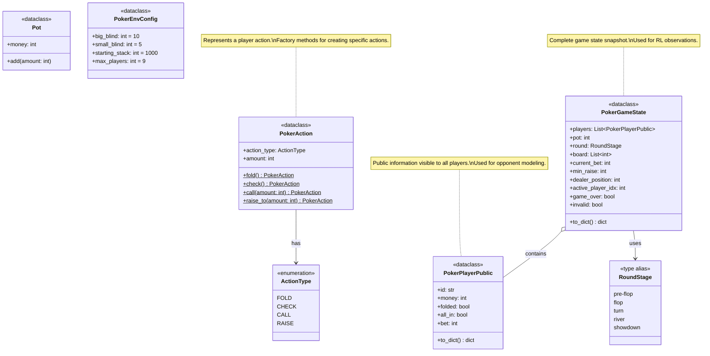
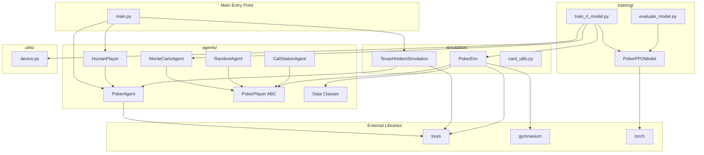
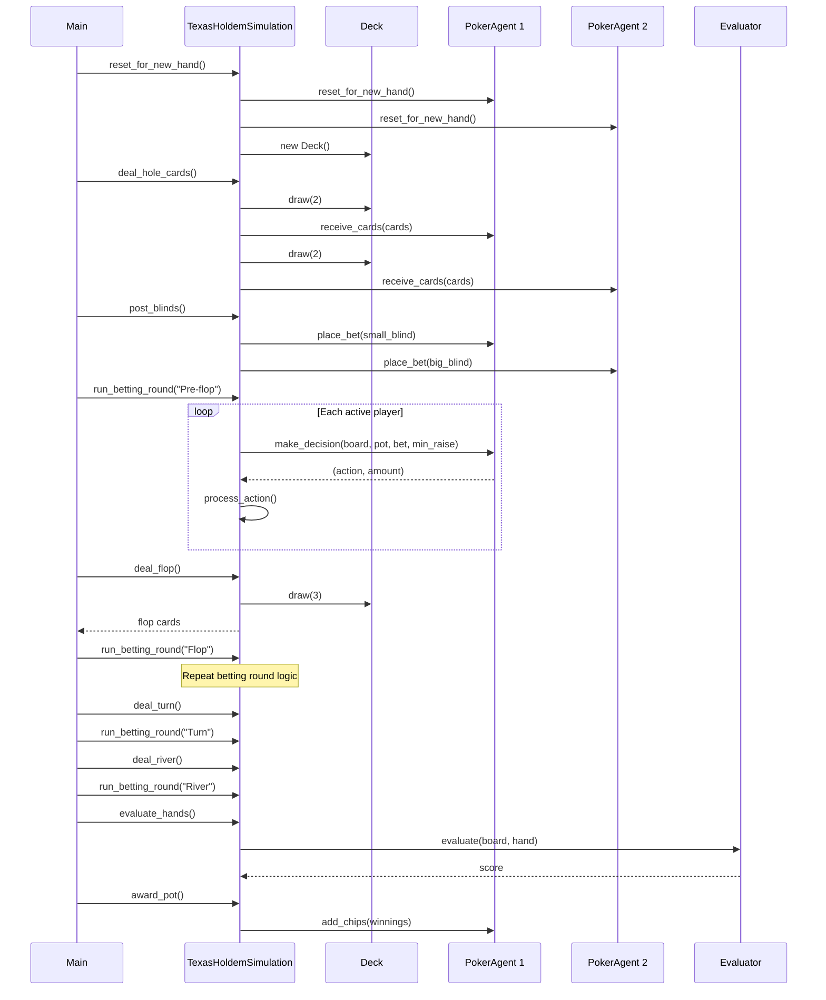
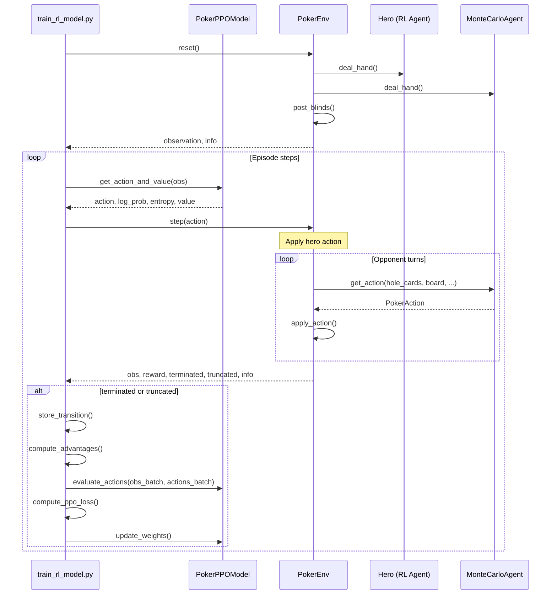
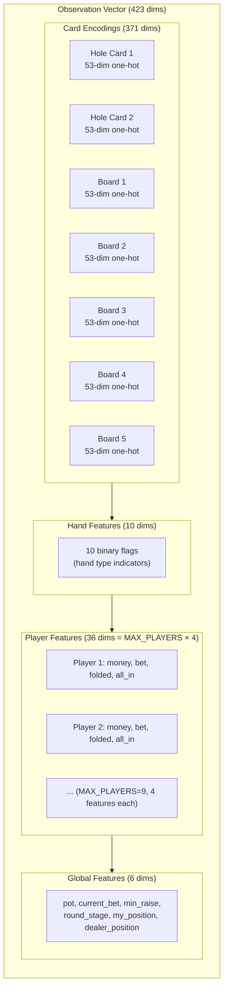
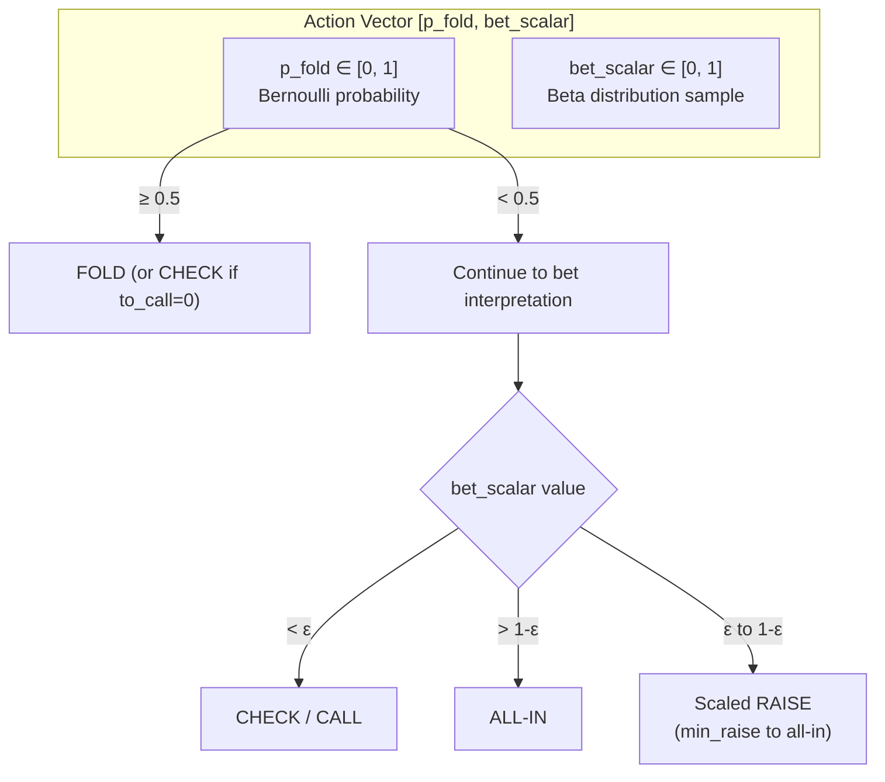

# Texas Hold'em System UML Diagrams

This document contains UML diagrams that illustrate the architecture and design of the Texas Hold'em poker simulation and AI system.

## Table of Contents

1. [Class Diagram Overview](#class-diagram-overview)
2. [Agents Module](#agents-module)
3. [Simulation Module](#simulation-module)
4. [Training Module](#training-module)
5. [Data Classes and Enums](#data-classes-and-enums)
6. [Component Diagram](#component-diagram)
7. [Sequence Diagrams](#sequence-diagrams)

---

## Class Diagram Overview

This high-level class diagram shows the main classes and their relationships across all modules.

```mermaid
classDiagram
    %% Abstract Base Class
    class PokerPlayer {
        <<abstract>>
        +id: str
        +money: int
        +folded: bool
        +all_in: bool
        +bet: int
        +total_invested: int
        -_private_cards: List~int~
        +get_public_info() PokerPlayerPublic
        +reset()
        +reset_money(starting_money: int)
        +reset_bet()
        +deal_hand(dealt_cards: Tuple)
        +get_hole_cards() List~int~
        +move_money(pot: Pot, amount: int) int
        +add_winnings(amount: int)
        +fold()
        +is_active() bool
        +get_action()* PokerAction
    }

    %% Concrete Agent Classes
    class PokerAgent {
        +name: str
        +hole_cards: List
        +evaluator: Evaluator
        +chips: int
        +current_bet: int
        +is_folded: bool
        +is_all_in: bool
        +receive_cards(cards)
        +reset_for_new_hand()
        +reset_current_bet()
        +get_hole_cards() List
        +get_chips() int
        +add_chips(amount)
        +place_bet(amount) int
        +fold()
        +make_decision(board, pot_size, current_bet_to_call, min_raise) Tuple
        +evaluate_hand(board) Tuple
        +calculate_equity(board, opponent_hands, remaining_deck_cards, num_simulations) float
    }

    class HumanPlayer {
        +make_decision(board, pot_size, current_bet_to_call, min_raise) Tuple
    }

    class MonteCarloAgent {
        +num_simulations: int
        +aggression: float
        +bluff_frequency: float
        +evaluator: Evaluator
        +get_action(hole_cards, board, pot, current_bet, min_raise, players, my_idx) PokerAction
        -_preflop_decision(hole_cards, to_call, min_raise, my_money, pot) PokerAction
        -_calculate_equity(hole_cards, board, num_opponents) float
        -_make_decision(equity, pot_odds, to_call, pot, min_raise, my_money, board_stage) PokerAction
    }

    class RandomAgent {
        +fold_prob: float
        +raise_prob: float
        +get_action(hole_cards, board, pot, current_bet, min_raise, players, my_idx) PokerAction
    }

    class CallStationAgent {
        +get_action(hole_cards, board, pot, current_bet, min_raise, players, my_idx) PokerAction
    }

    %% Simulation Classes
    class TexasHoldemSimulation {
        +agents: List~PokerAgent~
        +small_blind: int
        +big_blind: int
        +deck: Deck
        +evaluator: Evaluator
        +board: List
        +flop: List
        +turn: List
        +river: List
        +pot: int
        +pots: List
        +current_bet: int
        +min_raise: int
        +dealer_position: int
        +reset_for_new_hand()
        +deal_hole_cards()
        +post_blinds() Tuple
        +deal_flop() List
        +deal_turn() List
        +deal_river() List
        +run_betting_round(round_name) bool
        +calculate_all_equities() List
        +evaluate_hands() List
        +get_winner() List
        +create_side_pots() List
        +award_pot() List
        +get_pot_size() int
        +print_board()
        +print_game_state()
    }

    class PokerEnv {
        +config: PokerEnvConfig
        +players: List~PokerPlayer~
        +num_players: int
        +hero_idx: int
        +render_mode: str
        +deck: Deck
        +evaluator: Evaluator
        +pot: Pot
        +board: List~int~
        +round_stage: RoundStage
        +current_bet: int
        +min_raise: int
        +dealer_position: int
        +active_player_idx: int
        +game_over: bool
        +hand_complete: bool
        +reset(seed, options) Tuple
        +step(action) Tuple
        -_post_blinds()
        -_apply_action(player_idx, action) bool
        -_advance_to_hero_or_end()
        -_is_betting_round_complete() bool
        -_move_to_next_active_player()
        -_advance_round()
        -_end_hand()
        -_run_showdown()
        -_calculate_reward() float
        -_get_observation() ndarray
        -_get_info() Dict
        +render()
    }

    %% Training Classes
    class PokerPPOModel {
        +card_embed_dim: int
        +hidden_dim: int
        +card_embedding: CardEmbedding
        +hand_embedding: Sequential
        +numeric_embedding: Sequential
        +shared_trunk: Sequential
        +fold_head: Sequential
        +bet_head: Sequential
        +value_head: Sequential
        +forward(obs) Tuple
        +get_action_and_value(obs, deterministic) Tuple
        +evaluate_actions(obs, actions) Tuple
        +get_value(obs) Tensor
    }

    class CardEmbedding {
        +net: Sequential
        +forward(x) Tensor
    }

    class RLPokerPlayer {
        +id: str
        +model: PokerPPOModel
        +device: device
        +deterministic: bool
        +get_action_from_obs(obs) Tuple
    }

    %% Data Classes
    class PokerAction {
        <<dataclass>>
        +action_type: ActionType
        +amount: int
        +fold()$ PokerAction
        +check()$ PokerAction
        +call(amount)$ PokerAction
        +raise_to(amount)$ PokerAction
    }

    class PokerPlayerPublic {
        <<dataclass>>
        +id: str
        +money: int
        +folded: bool
        +all_in: bool
        +bet: int
        +to_dict() dict
    }

    class PokerGameState {
        <<dataclass>>
        +players: List~PokerPlayerPublic~
        +pot: int
        +round: RoundStage
        +board: List~int~
        +current_bet: int
        +min_raise: int
        +dealer_position: int
        +active_player_idx: int
        +game_over: bool
        +invalid: bool
        +to_dict() dict
    }

    class Pot {
        <<dataclass>>
        +money: int
        +add(amount)
    }

    class PokerEnvConfig {
        <<dataclass>>
        +big_blind: int
        +small_blind: int
        +starting_stack: int
        +max_players: int
    }

    class ActionType {
        <<enumeration>>
        FOLD
        CHECK
        CALL
        RAISE
    }

    %% Inheritance Relationships
    PokerPlayer <|-- MonteCarloAgent
    PokerPlayer <|-- RandomAgent
    PokerPlayer <|-- CallStationAgent
    PokerAgent <|-- HumanPlayer

    %% Composition & Association Relationships
    TexasHoldemSimulation o-- PokerAgent : contains
    PokerEnv o-- PokerPlayer : contains
    PokerEnv *-- Pot : has
    PokerEnv --> PokerEnvConfig : uses
    PokerEnv --> PokerGameState : creates
    PokerPlayer --> PokerPlayerPublic : creates
    PokerPlayer --> PokerAction : uses
    MonteCarloAgent --> PokerAction : returns
    RandomAgent --> PokerAction : returns
    CallStationAgent --> PokerAction : returns
    PokerAction --> ActionType : has
    PokerGameState o-- PokerPlayerPublic : contains
    PokerPPOModel *-- CardEmbedding : has
    RLPokerPlayer --> PokerPPOModel : uses
```



---

## Agents Module

Detailed view of the agents package showing the class hierarchy for different player types.



---

## Simulation Module

Classes responsible for game simulation and the RL training environment.



---

## Training Module

Neural network architecture for PPO-based reinforcement learning.



---

## Data Classes and Enums

Supporting data structures used throughout the system.



---

## Component Diagram

High-level view of system modules and their dependencies.



---

## Sequence Diagrams

### Game Hand Sequence

Shows the flow of a complete poker hand in the simulation.



### RL Training Step Sequence

Shows how the PPO training loop interacts with the environment.



---

## Observation Space Structure

Visual representation of the RL observation tensor structure.



---

## Action Space Structure

Visualization of how actions are interpreted.



---

## Notes

### Key Design Patterns

1. **Template Method Pattern**: `PokerPlayer` defines the abstract `get_action()` method that concrete agents implement
2. **Factory Pattern**: `PokerAction` uses class methods as factories for creating specific action types
3. **Observer Pattern (implicit)**: The environment observes and tracks player states
4. **Strategy Pattern**: Different agent implementations provide different decision-making strategies

### External Dependencies

- **treys**: Card evaluation library (Deck, Card, Evaluator)
- **gymnasium**: RL environment interface
- **torch**: Neural network implementation
- **numpy**: Numerical operations

### File Organization

```
Ultron-Texas-Hold-Em/
├── agents/
│   ├── __init__.py         # Exports PokerAgent
│   ├── agent.py            # PokerAgent class
│   ├── poker_player.py     # ABC, data classes, Pot
│   ├── human_player.py     # HumanPlayer
│   ├── monte_carlo_agent.py # MonteCarloAgent, RandomAgent, CallStationAgent
│   ├── game_state.py       # (empty)
│   └── opponent_models.py  # (empty)
├── simulation/
│   ├── __init__.py         # Exports TexasHoldemSimulation
│   ├── poker_simulator.py  # TexasHoldemSimulation
│   ├── poker_env.py        # PokerEnv (Gymnasium)
│   ├── card_utils.py       # (empty)
│   └── generate_dataset.py # (empty)
├── training/
│   ├── __init__.py
│   ├── ppo_model.py        # PokerPPOModel, CardEmbedding, RLPokerPlayer
│   ├── train_rl_model.py   # Training loop
│   ├── evaluate_model.py
│   └── losses.py
├── utils/
│   ├── __init__.py
│   └── device.py           # PyTorch device selection
├── tools/
│   ├── __init__.py
│   ├── config.py           # (empty)
│   ├── utils.py            # (empty)
│   └── visualize.py
├── main.py                 # Entry point
└── README.md
```
